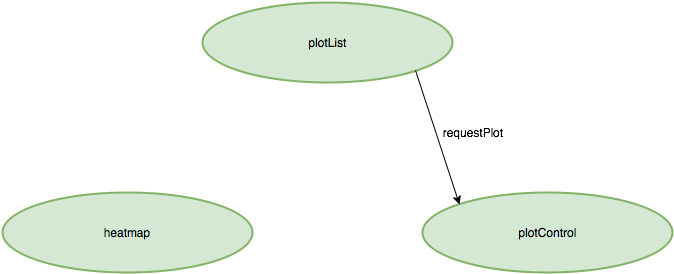
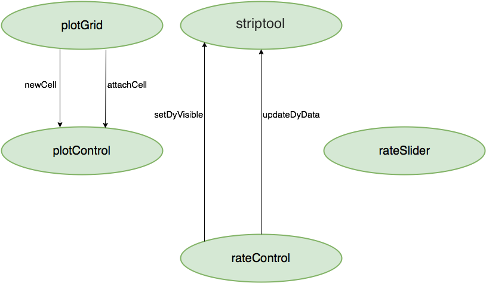
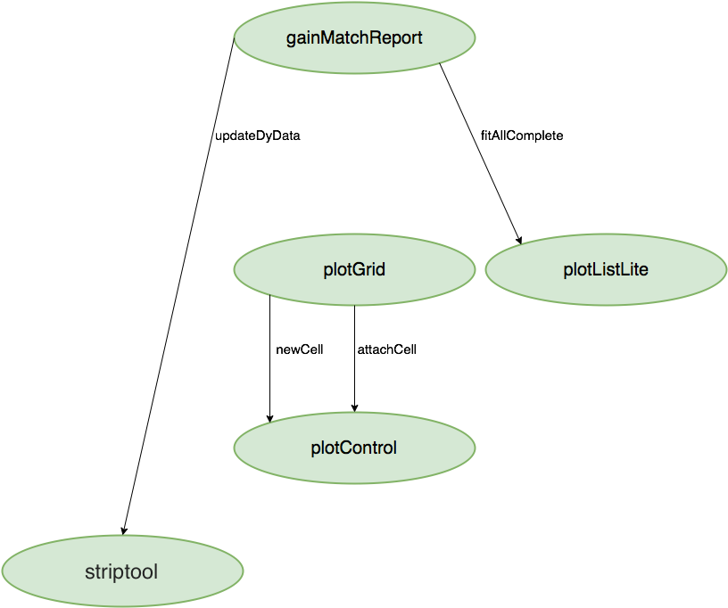

Spectrum Viewer
===============

A collection of remixable spectrum analysis tools.

## Setup

The Spectrum Viewer pages can be served as static pages from gh-pages, or anywhere you like. `server.js` provides a minimal node server that will do the job; dependencies and setup are at the top of that file.

### Spectrum Viewer
In order to point your Spectrum Viewer at the appropriate spectra, a couple of parameters need to be set in `scripts/spectrumViewer.js`:

 - `dataStore.spectrumServer` should be the url with port where raw spectra are served according to the API described below in 'Data Feeds'.
 - The `topGroups` object describes the plot selection and navigation; set names and ids of groups of plots as desired, and make sure the `items` key contains an array listing the exact names of plots to include in the corresponding subgroup.

### 2D Spectrum Viewer
In order to point your 2D Spectrum Viewer at the appropriate spectra, a couple of parameters need to be set in `scripts/2dSpectrumViewer.js`:

- `dataStore.spectrumServer` should be the url with port where raw spectra are served according to the API described below in 'Data Feeds'.
- `dataStore.ODBhost` should be the URL and host of the MIDAS experiment to write region of interest parameterizations to.
- The `topGroups` object describes the plot selection and navigation; set names and ids of groups of plots as desired, and make sure the `items` key contains an array listing the exact names of plots to include in the corresponding subgroup.

### Rate Monitor
In order to point your Rate Monitor at the appropriate spectra, a couple of parameters need to be set in `scripts/rateMonitor.js`:

 - `dataStore.spectrumServer` should be the url with port where raw spectra are served according to the API described below in 'Data Feeds'.
 - `dataStore.ODBrequests` should be an array of ODB requests to perform on refresh; see [specifications here](https://midas.triumf.ca/MidasWiki/index.php/AJAX).

### Gain Matcher
In order to point your Gain Matcher at the appropriate spectra, a couple of parameters need to be set in `scripts/gainMatcher.js`:

 - `dataStore.spectrumServer` should be the url with port where raw spectra are served according to the API described below in 'Data Feeds'.
 - `dataStore.ODBhost`: host and port of MIDAS ODB experiment.
 - `dataStore.ODBrequests` should be an array of ODB requests to perform before writing calibration constants to the MSC table; see [request specifications here](https://midas.triumf.ca/MidasWiki/index.php/AJAX).

## Contributing

Contributions are very welcome! If you have an idea, question or comment, please open an issue. If you would like to make a change to this project, please follow these steps:
 - start by opening an issue or empty PR to discuss your ideas
 - please limit individual PRs to less than 500 lines (Why? See figure 1 [here](https://smartbear.com/SmartBear/media/pdfs/11_Best_Practices_for_Peer_Code_Review.pdf)).
 - please encapsulate all new behavior wherever possible in functions of 50 lines or less each.

## Data Feeds

All these tools rely on being able to query spectrum data from a server providing JSON reponses. The expected API is as follows:

`?cmd=getSpectrumList`

Returns an array of all available spectrum names in the format:
```
getSpectrumList({'spectrumlist':['firstSpectrum', 'nextSpectrum', ..., 'lastSpectrum']})
```

`?cmd=callspechandler&spectrum0=firstSpecName&spectrum1=nextSpecName&...`

where the nth SpecName matches a string in the array returned by `getSpectrumList`, returns a JSON object that contains an element of the form `name : array of bin contents` for each 1D spectrum requested:

```
{'firstSpecName' : [0, 3, 2, 7, ...], 'nextSpecName' : [1,5,2,9, ...], ....}
```

or, for 2D spectra:

```
{'2dSpectrumName': [rowLength, z00, z10, ..., z01, z11,.... ]}
```

where `rowLength` is the number of bins in x in one row, and the z values of all bins are packed counting first along x bins, then along y bins.

If the named spectrum is not a valid spectrum, the return object above should contain an entry `'specName':null`.

## Engineering

All these projects are built on a collection of objects and HTML snippets encapsulated and imported via [HTML Templates](https://developer.mozilla.org/en/docs/Web/HTML/Element/template) and [HTML Imports](http://www.html5rocks.com/en/tutorials/webcomponents/imports/). All of these objects exchange information via a collection of [custom events](https://developer.mozilla.org/en-US/docs/Web/Guide/Events/Creating_and_triggering_events), as illustrated below, as well as through a global `dataStore` object. Layout is ala [Bootstrap](http://getbootstrap.com/), and client-side templating is built on [mustache.js](https://github.com/janl/mustache.js/).

### 0. Common Features

All these apps share some common design features:

 - Pageload timing looks like:
   - load global `dataStore` object (see below for description)
   - sketch out dom using wrapper `<div>`s
   - main scripting routine proceeds once `HTMLImportsLoaded` fires, indicating that the HTML templates and accompanying scripts are ready to go.
   - Most major page elements consist of an HTML template, accompanied by a JavaScript function that makes an object to namespace and manage the behavior of that element. Once `HTMLImportsLoaded` fires, these functions are called as constructors and their `.setup()` routine is invoked to set them up.
 - Each app uses a global `dataStore` object to namespace global variables. `dataStore` is initialized by a function `setupDataStore`, called immediately in the head. **This is the appropriate place to add global variables.** Documentation on `dataStore` keys is found inline with their declaration; note that a number of template objects draw their configurations from `dataStore`. Most notably, `dataStore` contains a key `plots`, an array of strings which label the `gammaspectrum.js` plotting objects available. Those plotting objects in turn live on an object `dataStore.viewers`, for easy global access by all elements; the majority of inter-component communication not encapsulated by a custom event is through reads and writes to these viewer objects.

 - Network requests are done via a series of [Promises](https://developer.mozilla.org/en/docs/Web/JavaScript/Reference/Global_Objects/Promise) and callbacks. When adding new network requests, **it is important to respect this pattern if you want responses to be dealt with at the correct time**. The pattern is:
   - All analyzer requests (per the spec above) are sent in parallel. Spectra are added to the appropriate plots and logged in the `dataStore` as they arrive.
   - On receipt of all analyzer info, all ODB requests are sent in parallel, and processed by the function named in the request's `callback` query string parameter.
   - After completion of all ODB requests, a global function `fetchCallback` is run, if it exists.

   This structure is found in `templates/plotControl/plotControl.js`, in `refreshAll()`, the central function responsible for orchestrating data refreshes over the network. In order to add an analyzer request, the appropriate URL must be added to the `queries` array found there; in order to add an ODB request, modify the string found in `dataStore.ODBrequests[0]`, per the ODB's [AJAX spec](https://midas.triumf.ca/MidasWiki/index.php/AJAX). In order to take action on reciept of ODB information, modify `parseODB()`; in order to take action immediately after all data has been refreshed, modify `fetchCallback()`.

### 1. Spectrum Viewer


The Spectrum Viewer elements communicate amongst themselves as above; nodes represent objects, and edges represent custom events. Basic behavior:

 - clicking on a spectrum name in `plotList` fires a `requestPlot` event, which tells `plotControl` to queue up that histogram for plotting in all cells currently active, and subsequently dispatches an `addPlotRow` event to add a row to the appropriate tables in `auxPlotControl`.
 - `plotControl` governs data refresh as described in section 0.1.
 - `plotGrid` fires `newCell` and `deleteCell` events at the control elements when a new plot is created or destroyed, to keep controls up to date; also, `attachCell` events are sent to `plotControl` to attach or unnattach the UI to each individual cell.
 - `fetchCallback()` refreshes all plots once data has arrived.

### 2. 2D Spectrum Viewer



The 2D Spectrum Viewer elements communicate amongst themselves as above; nodes represent objects, and edges represent custom events. Basic behavior:

- clicking on a spectrum name in `plotList` fires a `requestPlot` event, which tells `plotControl` to plot the selected histogram in the `heatmap` element.
- `fetchCallback()` refreshes all plots once data has arrived.

Note that this viewer relies on the [heatmap package](https://github.com/BillMills/heatmap), a high-performance library for quickly drawing histograms with large numbers of bins.

### 3. Rate Monitor



The Rate Monitor elements communicate amongst themselves as above; nodes represent objects, and edges represent custom events. Basic behavior:

 - As usual, `plotControl` is responsible for periodically refreshing spectrum and ODB data, in the same manner as above.
 - `fetchCallback` triggers a series of calculations after data is refreshed:
   - Linear background fits are performed around all the active gamma windows per the background subtraction options selected in `rateControl`, and those backgrounds are subtracted from their corresponding windows.
   - A rate is calculated by comparing the number of counts in each window, to the number of counts in the corresponding window (after background subtraction) the last time the spectrum was fetched; time between polls is estimated as the interval between receipt times of each poll of the spectrum at the browser.
   - The dygraph tracking rates and scalers as well as annotations is updated, per the window defined by `rateSlider`.
 - `rateControl` can send events to the dygraph to toggle series visibility (`setDyVisible`) and update its data (`updateDyData`).
 - `plotGrid` sends its `newCell` and `attachCell` events to `plotControl` exactly once in this case, to set up on page load.

### 4. Gain Matcher



The Gain Matcher elements communicate amongst themselves as above; nodes represent objects, and edges represent custom events. Basic behavior:

 - Data for all 64 GRIFFIN crystals is fetched exactly once, on pageload in the same manner as above by `plotControl`.
 - Upon initiating the gain matching procedure, `gainMatchReport` estimates the bins where the peaks requested will be found, fits a gaussian plus linear background to the tallest peak found there, and writes the result to its table. Upon completion, a `fitAllComplete` event is sent to `plotListLite` to set it to display the first plot in the series, and an `updateDyData` event is sent to `graph` to refresh the plot of peak widths as a function of detector.
